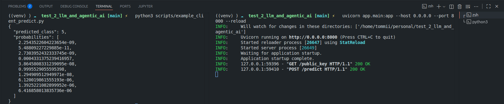

# MNIST FastAPI Inference with Hybrid Encryption

A FastAPI service that serves MNIST digit predictions using a ResNet18 model and secure, field-level encryption. Clients send the image as a base64 string encrypted with AES-GCM, and the AES key is wrapped with RSA-OAEP (hybrid encryption). A legacy RSA-only path is also supported for backwards compatibility.

# Demo API Usage




## Overview

- Framework: FastAPI, PyTorch, TorchVision
- Model: ResNet18 with final FC adapted to 10 MNIST classes
- Transport security (application layer):
	- Preferred: AES-GCM for the base64 image payload, with RSA-OAEP key wrapping
	- Legacy: single RSA-OAEP encrypted base64 image payload
- Keys: RSA keypair is generated on server startup if missing

## Repository structure

- `app/`
	- `main.py` — FastAPI app with `/public_key` and `/predict`
	- `models/predict.py` — Pydantic request/response models
	- `utils/encryption.py` — RSA and AES-GCM helpers, key generation and loading
- `scripts/client_predict.py` — AES-GCM client that sends the first MNIST image
- `checkpoints/` — includes `mnist_resnet18_epoch_3.pth`
- `data/MNIST/raw` — MNIST raw files (used by TorchVision without downloading)
- `notebook/train.ipynb` — training notebook

## Requirements

- Python 3.12.11
- See `requirements.txt` for dependencies (FastAPI, Uvicorn, Torch/TorchVision, cryptography, requests, etc.)

Install:

```bash
pip install -r requirements.txt
```

## Configuration

The server reads the following environment variables (a `.env` file is supported via `python-dotenv`):

- `MODEL_PATH` — path to the model weights (default: `checkpoints/mnist_resnet18_epoch_3.pth`)
- `PRIVATE_KEY_PATH` — RSA private key path (default: `secrets/private_key.pem`)
- `PUBLIC_KEY_PATH` — RSA public key path (default: `secrets/public_key.pem`)

On startup, the service will create the RSA keypair at the configured locations if missing.

## Running the API

Start the server (auto-reload for dev):

```bash
uvicorn app.main:app --reload
```

## Get public key:

- `GET /public_key` — returns `{ "public_key_pem": "-----BEGIN PUBLIC KEY-----..." }`

## Predict API

`POST /predict`

Preferred (AES-GCM hybrid):

```json
{
	"enc_key_b64": "<RSA-OAEP encrypted AES key, base64>",
	"nonce_b64": "<AES-GCM nonce, base64>",
	"ciphertext_b64": "<AES-GCM ciphertext+tag, base64>",
	"aad_b64": "<optional AAD, base64>"
}
```

- The plaintext being encrypted is the base64 representation of the image bytes (e.g., PNG), encoded as UTF-8.
- If `aad_b64` is supplied by the client, the same AAD must be used at decrypt time or the request will fail integrity verification.

Legacy (RSA-only):

```json
{
	"encrypted_image_b64": "<RSA-OAEP encrypted base64 image, base64>"
}
```

Response:

```json
{
	"predicted_class": 0,
	"probabilities": [0.1, 0.05, ...]
}
```

Notes:
- Preprocessing: images are resized to 224×224, converted to 3-channel grayscale, and converted to tensor.

## Clients

Two equivalent AES-GCM clients are included:

- `scripts/example_client_predict.py`

They will:
1) Fetch `/public_key`
2) Load the first MNIST image from `data/MNIST/raw` and export it as base64 PNG (plaintext)
3) Encrypt with AES-GCM (random 16/24/32-byte key)
4) Wrap the AES key with RSA-OAEP
5) POST to `/predict`

Example:

```bash
python scripts/example_client_predict.py --api-url http://127.0.0.1:8000 --data-root data --key-bytes 32 --aad "bind-this-request"
```